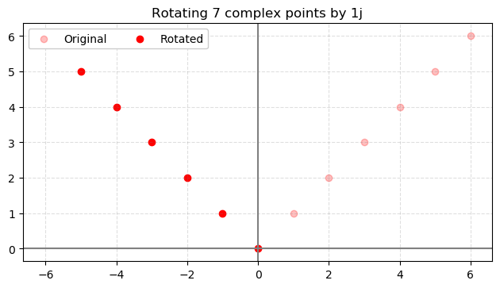
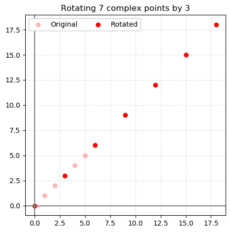

# Drill 1.3.2
We learned that multiplying by a complex number can be geometrically interpretted as rotating the vector by some angle, and stretching the vector (increasing its magnitude).

From QCCS: *Programming Drill 1.3.2 If you like graphics, write a program that accepts a small drawing around the origin of the complex plane and a complex number. The program should change the drawing by multiplying every point of the diagram by a complex number.*

## How to Plot
Open `plot.py` and adjust the following parameters:

* `amountRotate`: The complex number to multiply (rotate) the points by
* `numPoints`: Number of points to plot
* `startPoint`: The value of the first imaginary part of the first point
* `pointColor`: A string value that indiciates the color of the points. The original points will be plotted as a fainter version of this color.

Then plot the graph by running `python plot.py`. After previewing, the plot will be saved as `plot.png`.

### Examples
Rotating by 90 degrees

Stretching by 3

## Rotations
Setting the value of `amountRotate` will have the geometric effects that we learned about in this chapter:

* `1j`: The imaginary number `i`. Rotates points by 90 degrees (right angle)
* `Any real number`: Will stretch the magnitude of each point
* `a + bj`: Any complex number with real numbers `a` and `b`. Applies both rotation and stretching
